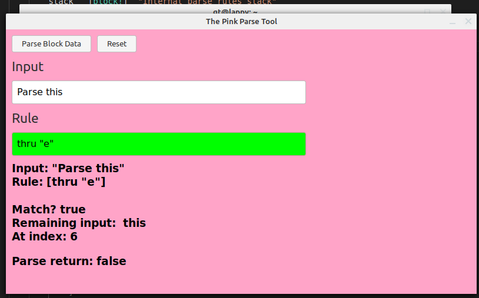
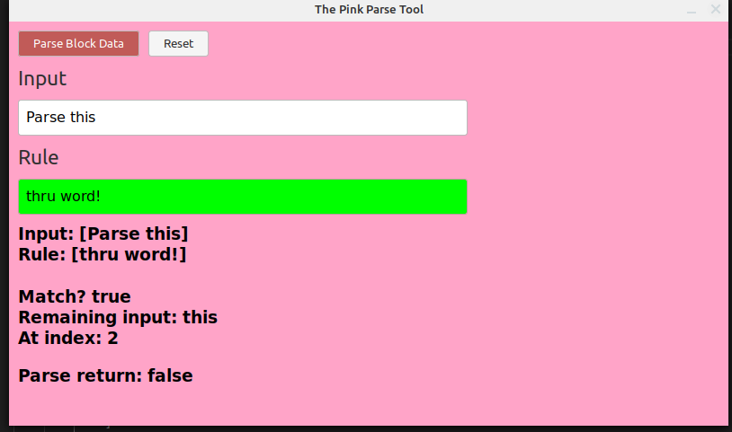

<<<<<<< HEAD
# The Pink Parse Tool
=======
# The Pink Parse Tool - A visual parse rule checker
>>>>>>> 1725a515dbdc1280e8d080ce259f0c9e37441493

Type in your input.

----

Type in your rule. 

It will check if it passes or fails as you type. Clearing the field will reset some things :)

----

Toggle to parse Block values.

<<<<<<< HEAD

=======

>>>>>>> 1725a515dbdc1280e8d080ce259f0c9e37441493
