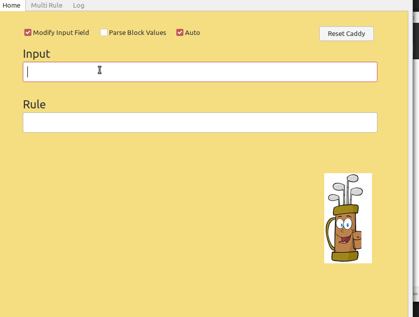
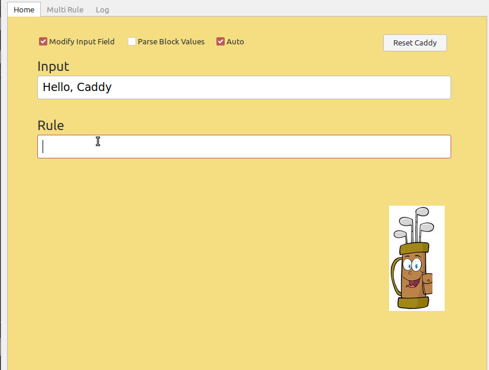
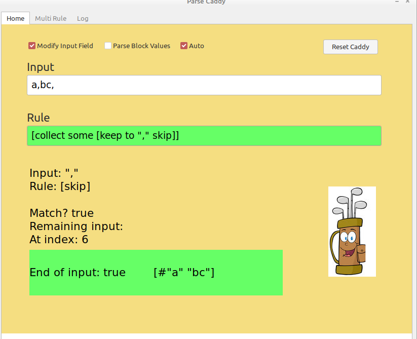
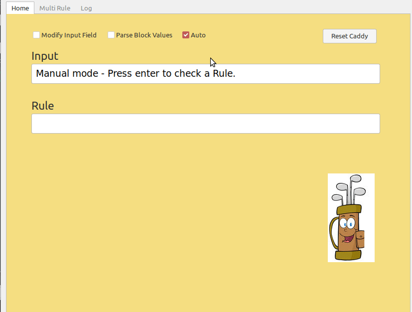
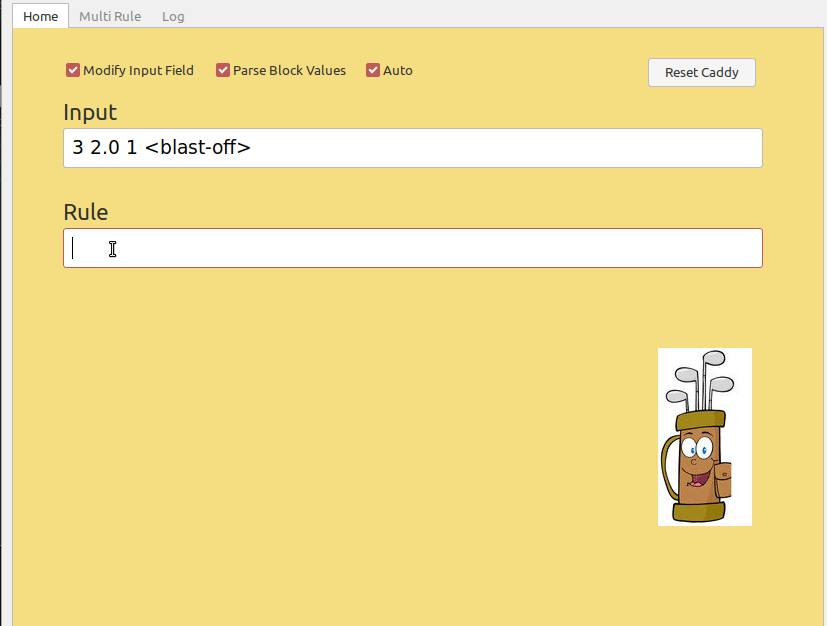
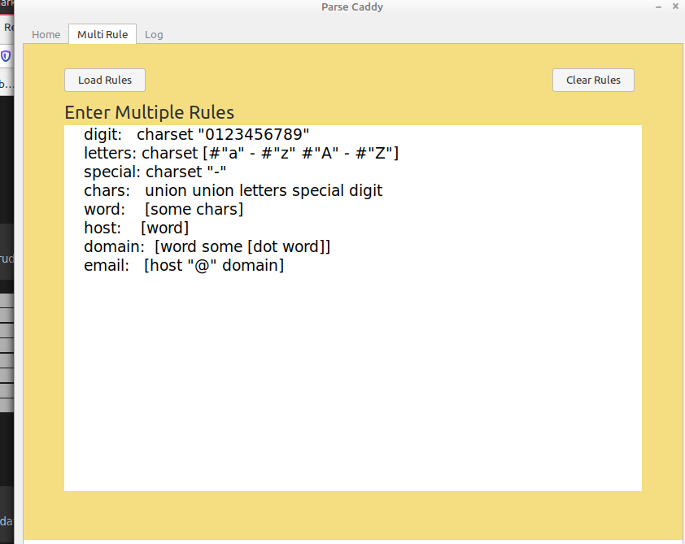
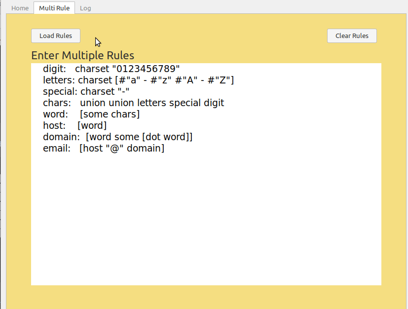
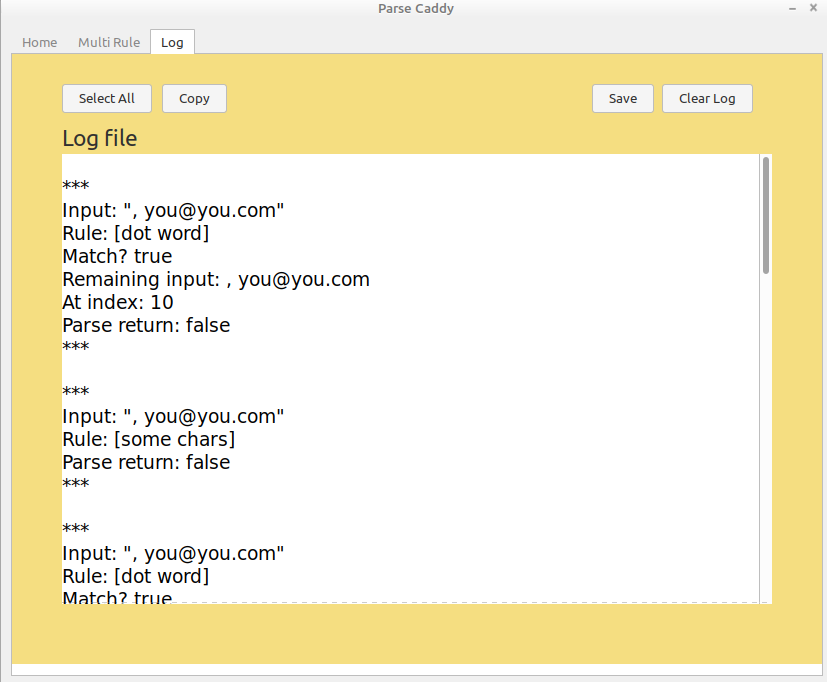
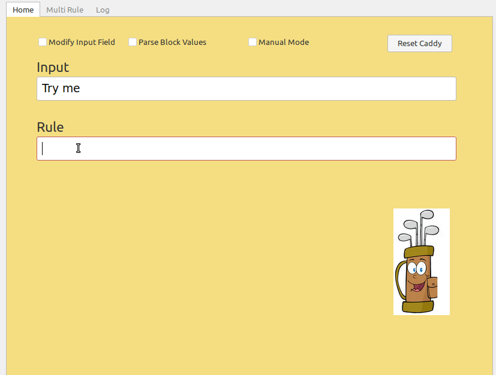

 

# Parse Caddy - A visual parse rule checker     

What's Parse?

From red-lang.org

"So, in short, what is Parse? It is an embedded DSL (we call them "dialects" in the Rebol world) for parsing input series using grammar rules. The Parse dialect is an enhanced member of the TDPL family. Parse's common usages are for checking, validating, extracting, modifying input data or even implementing embedded and external DSLs."

[Overview here.](https://www.red-lang.org/search?q=parse)

[Full documentation here.](https://github.com/red/docs/blob/master/en/parse.adoc)

This tool is intended to let a user see what is going on as they write basic to intermediate parse rules.

If you can improve this tool, I'm sure parse beginers would be grateful.

----

## Tool usage

* Type in your input. 
- Modify Input Field is recommended, otherwise watch the "Remaining input:" text for changes.

----

* Type in your rule. 

- In Auto Mode (default), the tool will check if a rule passes or fails as you type. Clearing the field will reset some things. The results of any probe should be visible in the console.

Collect / keep results will appear next to the End of input value:

----

* In Manual Mode, press Enter to check a rule.

----

* Check to parse Block values.

----

* Type in multiple parse rules here.

- Click the Load Rules button.

* Use them in the Rule field

-----

**CAUTION**

In the current version of the tool, anything in the Multiple Rules area will be loaded and executed by the Red language if you click Load Rules. 

Be careful.

----

**Log**

<!-- * There's a Log area for those who like logs. -->
- The buttons should be self explanatory, but let me know if you have questions.

----

**Samples**

* Moving positions

