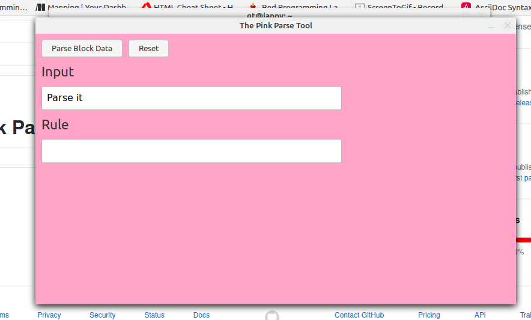
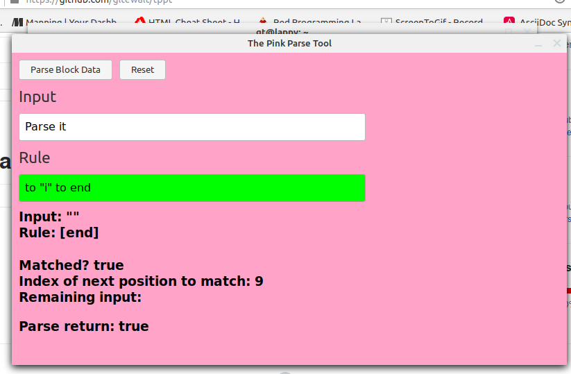
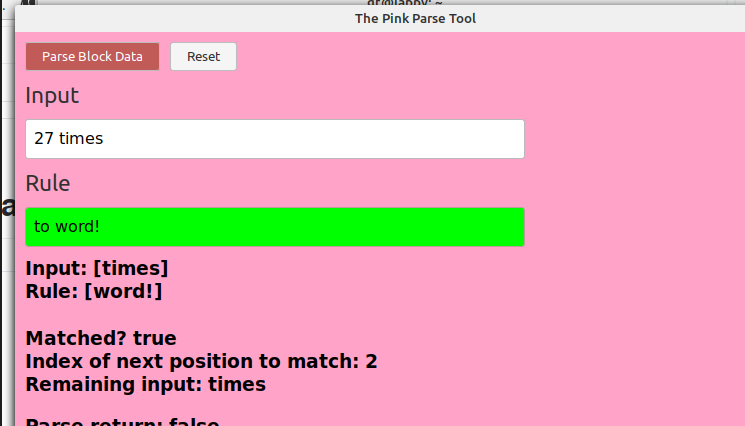

# The Pink Parse Tool

Type in your input.

----

Type in your rule. 

It will check if it passes or fails as you type. Clearing the field will reset some things :)

----

Toggle to parse Block values.

