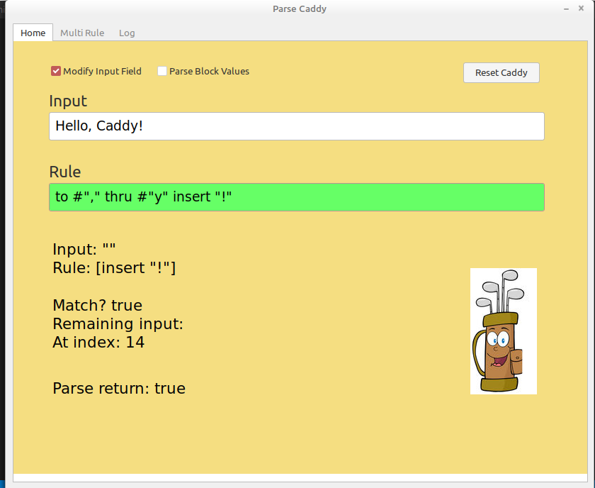
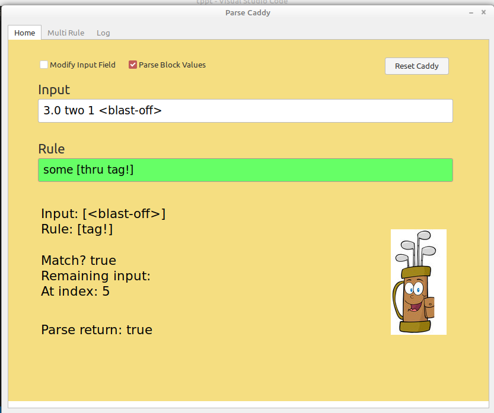

# Parse Caddy - A visual parse rule checker     

Type in your input. Modify Input? is recommended, otherwise watch the "Remaining input:" text for changes.

----

Type in your rule. 

It will check if it passes or fails as you type. Clearing the field will reset some things :)

----

Toggle to parse Block values.

----
